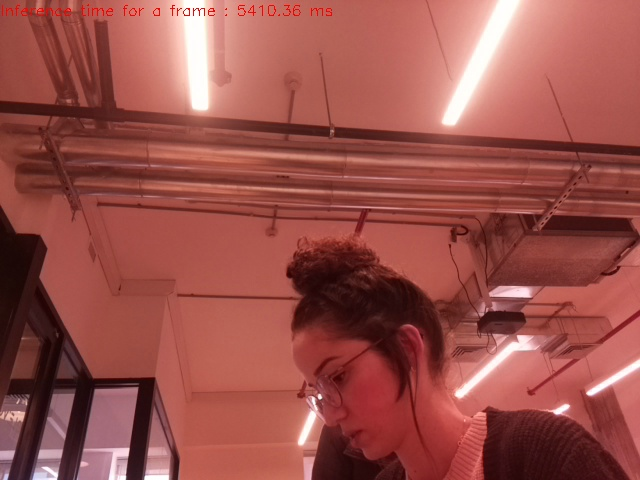

# SafeRide
```sh
 Identify wearing a helmet when riding a bicycle or scooter
```

<https://t.me/{BOT_ID}>


## content:


* [About the Project](#about-the-project)
* [Our team](#Our team)
* [Technologies](#Technologies)


## Our team

* Tamar
* Shoam cohen
* Efrat
* Racheli sabo


## About the Project


## Screenshots


<br />
<p align="center">
    
</p>


## Technologies


### Prerequisites
* Python 3.7
* pipenv
* {ADD MORE DEPENDENCIES HERE - FOR EXAMPLE MONGODB OR ANYTHING ELSE}

### Setup
* Clone this repo from github
* Install dependencies: `pipenv install`
* Get a BOT ID from the [botfather](https://telegram.me/BotFather).
* Create a `secret_settings.py` file:

        BOT_TOKEN = "your-bot-token-here"

### Run
To run the bot use:

    pipenv run python bot.py

### Running tests
First make sure to install all dev dependencies:

    pipenv install --dev

To run all test  use:

    pipenv run pytest

(Or just `pytest` if running in a pipenv shell.)

## Credits and References
* [Telegram Docs](https://core.telegram.org/bots)
* [python-telegram-bot](https://github.com/python-telegram-bot/python-telegram-bot)
* {ADD MORE REFERENCES TO LIBRARIES, APIS AND CODE SNIPPETS HERE}

