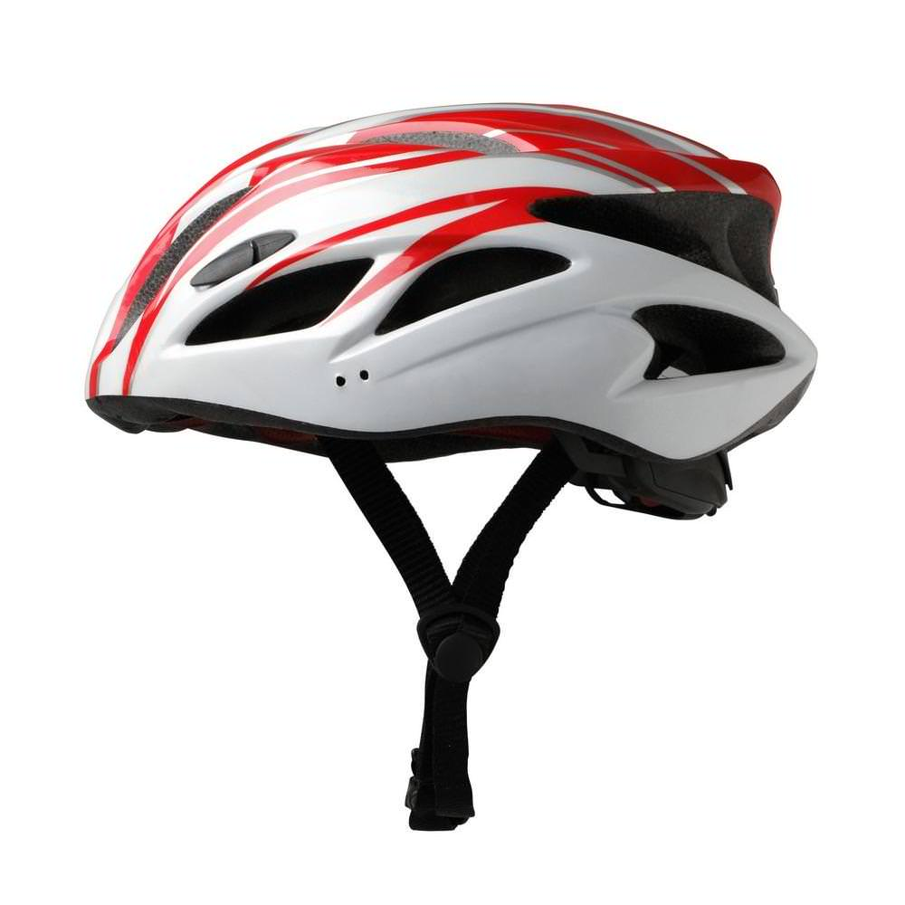
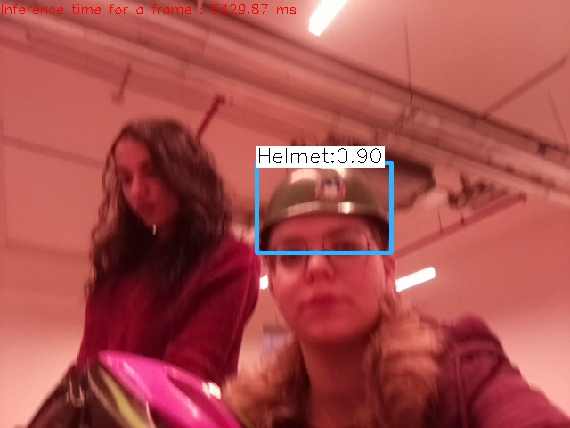

# SafeRide   
```sh
 Identify wearing a helmet when riding a bicycle or scooter
```
<https://t.me/{BOT_ID}>


## content:

* [Team Members](#members)
* [About the Project](#about-the-project)
* [Technologies](#Technologies)
* [Screenshots](#Screenshots)

## Team Members
* Tamar
* Shoam cohen
* Efrat
* Racheli sabo


## About the Project
### Review:
The purpose of the project is to check if the passenger is wearing a helmet during the riding, and start warning if not.
for this, we used the Raspberry pi camera.

### Audience:
* Rental companies.
* Parents.
* Optional: Police.

### Technological challenges:
* face detection
* Identify an helmet.
* Turn on alarm.
* Create a website for customers.
* work with Raspberry pi.

### expansion:
- When a user wants to rent a bicycle, he registered on the site and starts riding.
- Now, if he rides the entire ride with a helmet, he'll get a bonus.
- But, if he takes off his helmet, the alert starts, he doesn't get a bonus and he also gets an SMS and an email
with a picture of him without a helmet!


## Screenshots


<br />
<p align="center">
    
</p>

## Technologies
* [Raspberry Pi](https://en.wikipedia.org/wiki/Raspberry_Pi)
* [Flask](http://flask.palletsprojects.com/en/1.1.x/)
* [MongoDB](https://www.mongodb.com/)
* [Yolo](https://pjreddie.com/darknet/yolo/)
* [opencv](https://opencv.org/)


### Prerequisites
* Python 3.7
* pipenv
* {ADD MORE DEPENDENCIES HERE - FOR EXAMPLE MONGODB OR ANYTHING ELSE}


